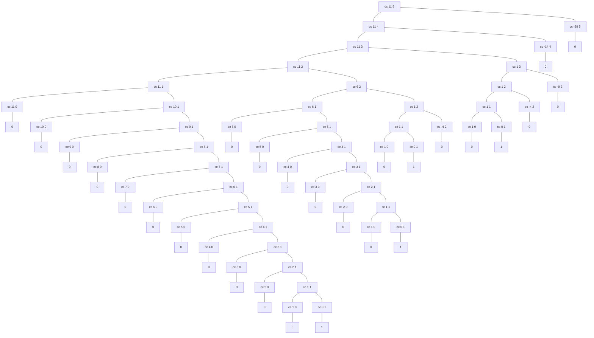

```mermaid
graph TD;
A[cc 11 5] --- B[cc 11 4] --- C[cc 11 3] --- D[cc 11 2] --- E[cc 11 1] --- F[cc 11 0] --- G[0];
E --- H[cc 10 1] --- I[cc 10 0] --- J[0];
H --- K[cc 9 1] --- L[cc 9 0] --- M[0];
K --- N[cc 8 1] --- O[cc 8 0] --- P[0];
N --- Q[cc 7 1] --- R[cc 7 0] --- S[0];
Q --- T[cc 6 1] --- U[cc 6 0] --- V[0];
T --- W[cc 5 1] --- X[cc 5 0] --- Y[0];
W --- Z[cc 4 1] --- AA[cc 4 0] --- AB[0];
Z --- AC[cc 3 1] --- AD[cc 3 0] --- AE[0];
AC --- AF[cc 2 1] --- AG[cc 2 0] --- AH[0];
AF --- AI[cc 1 1] --- AJ[cc 1 0] --- AK[0];
AI --- AL[cc 0 1] --- AM[1];
D --- AN[cc 6 2] --- AO[cc 6 1] --- AP[cc 6 0] --- AQ[0];
AO --- AR[cc 5 1] --- AS[cc 5 0] --- AT[0];
AR --- AU[cc 4 1] --- AV[cc 4 0] --- AW[0];
AU --- AX[cc 3 1] --- AY[cc 3 0] --- AZ[0];
AX --- BA[cc 2 1] --- BB[cc 2 0] --- BC[0];
BA --- BD[cc 1 1] --- BE[cc 1 0] --- BF[0];
BD --- BG[cc 0 1] --- BH[1];
AN --- BI[cc 1 2] --- BJ[cc 1 1] --- BK[cc 1 0] --- BL[0];
BJ --- BM[cc 0 1] --- BN[1];
BI --- BO[cc -4 2] --- BP[0];
C --- BR[cc 1 3] --- BS[cc 1 2] --- BT[cc 1 1] --- BU[cc 1 0] --- BV[0];
BT --- BW[cc 0 1] --- BX[1];
BS --- BY[cc -4 2] --- BZ[0];
BR --- CA[cc -9 3] --- CB[0];
B --- CC[cc -14 4] --- CD[0];
A --- CE[cc -39 5] --- CF[0];
```

スペースの増加の程度：$\Theta(n) = n$

ステップ数の増加の程度：$\Theta(n) = n^5$

参考
- https://sicp-solutions.net/post/sicp-solution-exercise-1-14/
